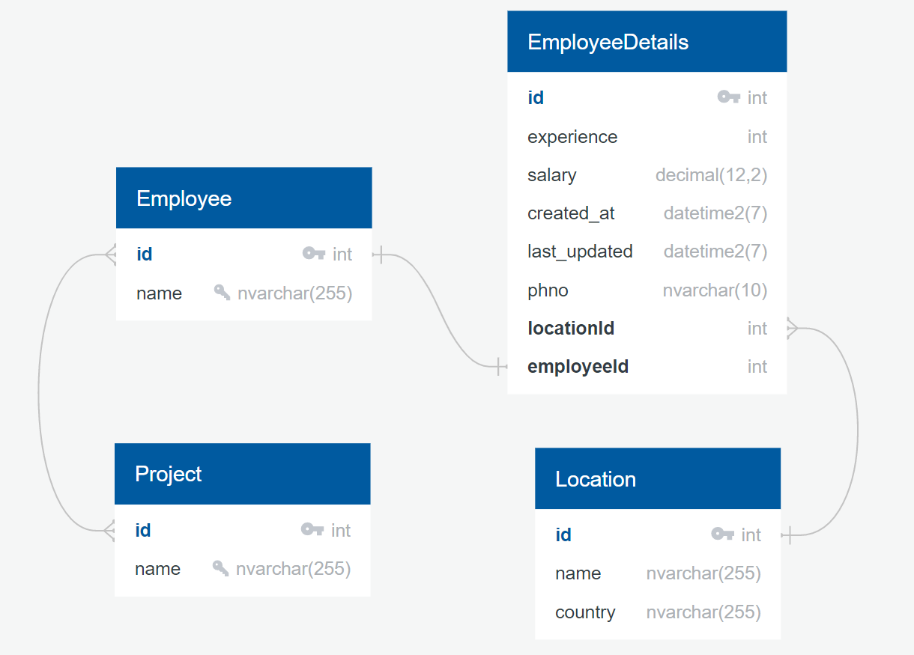

# Mini-Project
Uses MS SQL server

## Running The App
- Configure the `.env` using the `.env.template` template provided.
- Install the node packages required
- `nodemon` - To start the application in dev environment.

## ER Diagram


## Routes
### Location
**Add a location**
- Request Type: POST
- Parameters: city, country
- Example: To insert *Hyderabad, India*
    ```
    http://localhost:9000/location?city=Hyderabad&country=India
    ```
**Get all added locations**
- Request Type: GET
- Parameters: None
- Example: 
    ```
    http://localhost:9000/location
    ```

**Delete a location**
- Request Type: DELETE
- Parameters: city, country
- Example: To delete *Hyderabad, India*
    ```
    http://localhost:9000/location?city=Hyderabad&country=India
    ```
### Employee
**Add an Employee**
- Request Type: POST
- Parameters: name, phno, experience, city, country and salary
- Phone Number is validated
- Example: To insert *Ename, Eexperience, Ecity, Ecountry and Esalary*
    ```
    name :Abhiram
    experience :10
    city :Hyderabad
    country :India
    salary :1000
    phno:1234567890
    ```
    ```
    http://localhost:9000/employee/?name=Abhiram&experience=10&city=Hyderabad&country=India&salary=1000&phno=1234567890
    ```

**Get all added employees**
- Request Type: GET
- Parameters: None
- Example: 
    ```
    http://localhost:9000/employee
    ```

**Get the details of given employee**
- Request Type: GET
- Using ID
    - Example: Get details of the employee with id=1
        ```
        http://localhost:9000/employee/id/1
        ```
- Using Name
    - Example: Get details of the employee with name=Abhiram
        ```
        http://localhost:9000/employee/name/Abhiram
        ```

**Get all added employees whose salary is in between the specified range**
- Request Type: GET
- Parameters: lower_bound, upper_bound
- Example:  Get employees with salary between 0 and 2000
    ```
    http://localhost:9000/employee/salary?upper_bound=2000&lower_bound=0
    ```

**Update an Employee**
- Request Type: PUT
- Parameters: eid, ename, change_phno, change_experience, change_city and change_country
- Phone Number is validated
  
    **Note**: 
    - eid or ename is required
    - Also, if you wish to update location, change_city and change_country both are required.

- Example: To update  `eids` or `enames` *experience, city, country and salary*
    ```
    http://localhost:9000/employee/?eid=6&ename=Abhiram&change_experience=10&change_city=Hyderabad&change_country=India&change_salary=1004&change_phno=1234567891
    ```

**Delete an Employee**
- Request Type: DELETE
- Parameters: eid or ename (If both are provided, eid is prioritized)
- Example: To delete an Employee with eid=1 or ename=Abhiram
    ```
    http://localhost:9000/employee/?ename=Abhiram&eid=1
    ```

### Project
**Add a project**
- Request Type: POST
- Parameters: project_name
- Example: To insert a project with name *JSTutorials*
	```
	http://localhost:9000/project/?project_name=JSTutorials
	```
**List all projects**
- Request Type: GET
- Parameters: None
- Example: 
    ```
    http://localhost:9000/project/
    ```

**Get the details of given project**
- Request Type: GET
- Using ID
    - Example: Get details of the project with id=1
        ```
        http://localhost:9000/project/id/1
        ```
- Using Name
    - Example: Get details of the project with name=JSTutorials
        ```
        http://localhost:9000/project/name/JSTutorials
        ```

**Add an Employee to a project**
- Request Type: PUT
- Parameters: (eid, pid) or (ename, pname)
- Example: Add an employee with eid=1 to project whose pid=2
    ```
    http://localhost:9000/project/addemp?pid=2&eid=1
    ```
- Example: Add an employee with ename=Abhiram to project whose pname=JSTutorials
    ```
    http://localhost:9000/project/addemp?ename=Abhiram&pname=JSTutorials
    ```
**Remove an Employee from a project**
- Request Type: PUT
- Parameters: (eid, pid) or (ename, pname)
- Example: Delete an employee with eid=1 from project whose pid=2
    ```
    http://localhost:9000/project/delemp?pid=2&eid=1
    ```
- Example: Delete an employee with ename=Abhiram from project whose pname=JSTutorials
    ```
    http://localhost:9000/project/delemp?ename=Abhiram&pname=JSTutorials
    ```

**List the locations of the employees working on a project**
- Request Type: GET
- Parameters: pid or pname (If both are provided, pid is prioritized)
- Example:  Locations of the employees working on a project with pid=1 or pname=JSTutorials
    ```
    http://localhost:9000/project/locations?pid=1&pname=JSTutorials
    ```

**Delete a project**
- Request Type: DELETE
- Parameters: pid or pname (If both are provided, pid is prioritized)
- Example: To delete a project with pid=1 or pname=JSTutorials
    ```
    http://localhost:9000/project/?pid=1&pname=JSTutorials
    ```

## TypeORM Migration commands
```bash
set mig_name=migrationName
npm run migration:generate
npm run migration:run
npm run migration:revert
```